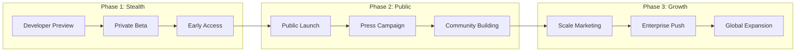

# TUSKS OS - Implementation Plan

## 🎯 Executive Summary

This document outlines the concrete steps to build TUSKS OS from concept to market dominance, with technical architecture, development phases, and resource requirements.

---

## 🏗️ Technical Architecture Deep Dive

### Core System Design

```
┌────────────────────────────────────────────────────────────────┐
│                     TUSKS OS Architecture                       │
├────────────────────────────────────────────────────────────────┤
│                                                                  │
│  Browser Runtime Environment                                    │
│  ┌──────────────────────────────────────────────────────────┐  │
│  │                                                          │  │
│  │  HTML App Container                                      │  │
│  │  ┌────────────────────────────────────────────────┐     │  │
│  │  │  DOCTYPE: TUSKS-APP-1.0                        │     │  │
│  │  │  Security: CSP + Sandbox                       │     │  │
│  │  │  Runtime: WebWorkers + WASM                    │     │  │
│  │  │  Storage: IndexedDB + LocalStorage             │     │  │
│  │  └────────────────────────────────────────────────┘     │  │
│  │                                                          │  │
│  │  JavaScript Core Library                                 │  │
│  │  ┌────────────────────────────────────────────────┐     │  │
│  │  │  tusks-core.js (50KB gzipped)                  │     │  │
│  │  │  - File System Abstraction                     │     │  │
│  │  │  - Database Interface                          │     │  │
│  │  │  - Plugin Manager                              │     │  │
│  │  │  - AI Bridge                                   │     │  │
│  │  │  - Sync Engine                                 │     │  │
│  │  └────────────────────────────────────────────────┘     │  │
│  │                                                          │  │
│  └──────────────────────────────────────────────────────────┘  │
│                                                                  │
│  Native Bridge Layer (Electron/Tauri)                          │
│  ┌──────────────────────────────────────────────────────────┐  │
│  │  File System Access                                      │  │
│  │  SQLite/DuckDB Native                                   │  │
│  │  Git Operations                                         │  │
│  │  System Integration                                     │  │
│  │  CLI Tool Execution                                     │  │
│  └──────────────────────────────────────────────────────────┘  │
│                                                                  │
│  Cloud Services Layer                                           │
│  ┌──────────────────────────────────────────────────────────┐  │
│  │  TUSKS Sync (Git-based)                                 │  │
│  │  Marketplace API                                        │  │
│  │  Professional Services                                  │  │
│  │  AI Providers (Claude, GPT-4, etc.)                    │  │
│  │  Database Services (Postgres, Neo4j, Qdrant)           │  │
│  └──────────────────────────────────────────────────────────┘  │
│                                                                  │
└────────────────────────────────────────────────────────────────┘
```

### HTML App Specification

```html
<!-- TUSKS App Standard Structure -->
<!DOCTYPE html>
<html data-tusks-version="1.0" data-tusks-app="app-name">
<head>
    <meta charset="UTF-8">
    <meta name="tusks-app-id" content="unique-app-id">
    <meta name="tusks-app-version" content="1.0.0">
    <meta name="tusks-app-author" content="author-name">
    <meta name="tusks-app-license" content="MIT">
    
    <!-- Security Policy -->
    <meta http-equiv="Content-Security-Policy" 
          content="default-src 'self'; 
                   script-src 'self' 'unsafe-inline' tusks:; 
                   connect-src 'self' https://api.tusks.os">
    
    <!-- TUSKS Core -->
    <link rel="stylesheet" href="tusks://core/styles.css">
    <script src="tusks://core/runtime.js"></script>
    
    <!-- App Styles -->
    <style>
        /* App-specific styles */
    </style>
</head>
<body>
    <!-- TUSKS Standard Components -->
    <tusks-header>
        <tusks-nav></tusks-nav>
        <tusks-search></tusks-search>
        <tusks-ai-assistant></tusks-ai-assistant>
    </tusks-header>
    
    <tusks-sidebar>
        <!-- App navigation -->
    </tusks-sidebar>
    
    <main id="app-content">
        <!-- App content -->
    </main>
    
    <tusks-footer>
        <tusks-sync-status></tusks-sync-status>
        <tusks-version></tusks-version>
    </tusks-footer>
    
    <script>
        // App initialization
        const app = new TusksApp({
            id: 'unique-app-id',
            name: 'App Name',
            version: '1.0.0',
            database: 'app-name.db',
            storage: 'local'
        });
        
        // Database setup
        const db = await app.database({
            type: 'sqlite',
            schema: {
                // Table definitions
            }
        });
        
        // AI integration
        const ai = await app.ai({
            model: 'claude-3',
            context: 'business-app'
        });
        
        // App logic here
    </script>
</body>
</html>
```

### Database Architecture

```yaml
Local Database Stack:
  SQLite (Primary):
    Purpose: Structured business data
    Features:
      - Full SQL support
      - ACID transactions
      - Zero configuration
      - Embedded in HTML
    Usage:
      - CRM contacts
      - Accounting records
      - Inventory management
      - Task tracking
      
  DuckDB (Analytics):
    Purpose: OLAP and analytics
    Features:
      - Columnar storage
      - Fast aggregations
      - Parquet support
      - SQL compatible
    Usage:
      - Business intelligence
      - Report generation
      - Data analysis
      - Time-series data
      
  IndexedDB (Browser):
    Purpose: Document storage
    Features:
      - NoSQL interface
      - Large storage capacity
      - Async operations
      - Binary support
    Usage:
      - File attachments
      - Images and media
      - Cache layers
      - Offline queue

Cloud Database Services:
  PostgreSQL:
    Purpose: Shared team data
    Features:
      - Multi-user access
      - Row-level security
      - Real-time subscriptions
      - JSONB support
    Usage:
      - Team collaboration
      - Shared resources
      - Central truth source
      
  Neo4j:
    Purpose: Knowledge graphs
    Features:
      - Graph relationships
      - Pattern matching
      - Path algorithms
      - Visualization
    Usage:
      - Customer relationships
      - Product recommendations
      - Organizational charts
      - Network analysis
      
  Qdrant:
    Purpose: Vector search
    Features:
      - Semantic search
      - Similarity matching
      - AI embeddings
      - Fast retrieval
    Usage:
      - Document search
      - Product matching
      - Content recommendations
      - AI-powered queries
```

---

## 📅 Development Phases

### Phase 1: Core Foundation (Weeks 1-4)

```yaml
Week 1: Repository & Architecture
  Tasks:
    ✅ Create GitHub repository structure
    ✅ Set up monorepo with Turborepo
    ✅ Initialize core packages
    ✅ Set up CI/CD with GitHub Actions
    ✅ Create documentation structure
    
  Deliverables:
    - github.com/tusks-os/tusks
    - Basic README and CONTRIBUTING
    - License (MIT)
    - Security policy
    - Code of conduct

Week 2: Core Runtime
  Tasks:
    ✅ Build tusks-core.js library
    ✅ HTML app loader system
    ✅ Plugin architecture
    ✅ Security sandbox
    ✅ Basic file system abstraction
    
  Code Structure:
    packages/
    ├── core/           # Core runtime library
    ├── cli/            # CLI tools
    ├── types/          # TypeScript definitions
    ├── sdk/            # Developer SDK
    └── test-utils/     # Testing utilities

Week 3: Database Layer
  Tasks:
    ✅ SQLite WASM integration
    ✅ DuckDB WASM integration
    ✅ IndexedDB abstraction
    ✅ Query builder interface
    ✅ Migration system
    
  API Design:
    const db = new TusksDB({
      type: 'sqlite',
      name: 'myapp.db',
      version: 1,
      migrations: [...]
    });

Week 4: First Apps
  Tasks:
    ✅ Note-taking app
    ✅ Task management app
    ✅ Contact manager
    ✅ File browser
    ✅ Settings manager
    
  App Structure:
    apps/
    ├── notes/          # Note-taking app
    ├── tasks/          # Task management
    ├── contacts/       # Contact manager
    ├── files/          # File browser
    └── settings/       # System settings
```

### Phase 2: Desktop Application (Weeks 5-8)

```yaml
Week 5-6: Electron/Tauri Wrapper
  Tasks:
    ✅ Desktop application shell
    ✅ Native file system access
    ✅ System tray integration
    ✅ Auto-updater
    ✅ Native menus
    
  Platform Support:
    - Windows 10/11
    - macOS 11+
    - Ubuntu 20.04+

Week 7-8: Git Integration
  Tasks:
    ✅ Git operations wrapper
    ✅ Auto-commit functionality
    ✅ Merge conflict resolution
    ✅ GitHub integration
    ✅ Sync engine
    
  Sync Architecture:
    - Every change creates a commit
    - Background push/pull
    - Conflict resolution UI
    - Branch management
    - History visualization
```

### Phase 3: AI Integration (Weeks 9-12)

```yaml
Week 9-10: AI Infrastructure
  Tasks:
    ✅ LLM provider abstraction
    ✅ Claude API integration
    ✅ GPT-4 integration
    ✅ Local LLM support (Ollama)
    ✅ Prompt management system
    
  AI Features:
    - Natural language queries
    - Document generation
    - Data analysis
    - Code generation
    - Smart suggestions

Week 11-12: AI Apps
  Tasks:
    ✅ AI chat interface
    ✅ Document assistant
    ✅ Code generator
    ✅ Data analyzer
    ✅ Writing assistant
    
  Integration Points:
    - Every app gets AI assist
    - Context-aware suggestions
    - Natural language commands
    - Automated workflows
    - Smart templates
```

### Phase 4: Marketplace (Weeks 13-16)

```yaml
Week 13-14: Marketplace Infrastructure
  Tasks:
    ✅ App registry system
    ✅ Developer portal
    ✅ Payment processing (Stripe)
    ✅ License management
    ✅ Update distribution
    
  Marketplace Features:
    - App discovery
    - User reviews
    - Version management
    - Revenue sharing
    - Analytics dashboard

Week 15-16: Developer Tools
  Tasks:
    ✅ App creation wizard
    ✅ Testing framework
    ✅ Documentation generator
    ✅ Publishing pipeline
    ✅ Revenue tracking
    
  Developer Experience:
    tusks create app my-app
    tusks test
    tusks build
    tusks publish
    tusks analytics
```

---

## 👥 Team Structure

### Core Team Requirements

```yaml
Founders (2-3):
  CEO/Vision:
    - Business strategy
    - Fundraising
    - Community building
    - Partnerships
    
  CTO/Architecture:
    - Technical leadership
    - System design
    - Security oversight
    - Performance optimization
    
  CPO/Product:
    - User experience
    - Feature prioritization
    - Market research
    - Customer success

Engineering (5-10):
  Core Platform (2):
    - Runtime development
    - Plugin system
    - Security implementation
    - Performance optimization
    
  Applications (2):
    - Core apps development
    - App framework
    - UI components
    - Testing infrastructure
    
  Infrastructure (2):
    - Cloud services
    - Database systems
    - Sync engine
    - Deployment pipelines
    
  AI/ML (2):
    - LLM integration
    - Vector search
    - Knowledge graphs
    - Model optimization
    
  Developer Tools (2):
    - SDK development
    - Documentation
    - CLI tools
    - Testing frameworks

Operations (3-5):
  Developer Relations:
    - Community management
    - Documentation
    - Tutorials
    - Support
    
  Business Development:
    - Partnerships
    - Enterprise sales
    - Professional network
    - Market expansion
    
  Marketing:
    - Content creation
    - Social media
    - SEO/SEM
    - Event planning
```

---

## 💰 Funding Strategy

### Bootstrap Phase (Months 1-3)

```yaml
Revenue Sources:
  Early Access Program:
    - $99 lifetime license (first 1000 users)
    - $199 developer license (first 500)
    - $999 enterprise pilot (first 10)
    Target: $200,000
    
  Consulting:
    - Migration services: $5,000-50,000
    - Custom development: $10,000-100,000
    - Training: $2,000-10,000
    Target: $100,000
    
  Grants:
    - Open source foundations
    - Government innovation programs
    - Privacy-focused organizations
    Target: $100,000
    
  Total Bootstrap Target: $400,000
```

### Seed Round (Month 4-6)

```yaml
Funding Requirements:
  Amount: $2-3 million
  
  Use of Funds:
    - Team expansion (10 people): $1.5M
    - Infrastructure: $300K
    - Marketing: $200K
    - Legal/Compliance: $200K
    - Operations: $300K
    - Reserve: $500K
    
  Investor Targets:
    - Open source focused VCs
    - Privacy/security funds
    - Angel investors from SaaS
    - Strategic partners
    
  Valuation: $10-15 million
```

### Series A (Month 12-18)

```yaml
Growth Metrics Required:
  - 100,000+ active users
  - 1,000+ apps in marketplace
  - $500K+ monthly revenue
  - 50%+ month-over-month growth
  
Funding Requirements:
  Amount: $15-25 million
  
  Use of Funds:
    - Team scaling (50 people): $15M
    - Infrastructure scaling: $3M
    - Marketing/Sales: $3M
    - International expansion: $2M
    - Strategic acquisitions: $2M
    
  Valuation: $100-150 million
```

---

## 🚀 Go-to-Market Strategy

### Launch Sequence



### Marketing Channels

```yaml
Developer Marketing:
  Content:
    - Technical blog posts
    - Video tutorials
    - Live coding streams
    - Conference talks
    - Open source contributions
    
  Communities:
    - GitHub discussions
    - Discord server
    - Reddit communities
    - Stack Overflow presence
    - Twitter/X engagement

Business Marketing:
  Content:
    - Case studies
    - ROI calculators
    - Comparison guides
    - Webinars
    - Podcasts
    
  Channels:
    - LinkedIn campaigns
    - Industry publications
    - Partner channels
    - Referral program
    - Content marketing

Viral Mechanisms:
  Built-in Sharing:
    - "Powered by TUSKS" badge
    - Referral rewards
    - Network effects
    - Template sharing
    - Public app gallery
    
  Community Growth:
    - User-generated content
    - Success stories
    - Developer showcases
    - Business transformations
    - Cost savings reports
```

---

## 🎯 Success Metrics

### Key Performance Indicators

```yaml
User Metrics:
  Acquisition:
    - Daily active users
    - Weekly active users
    - Monthly active users
    - User retention (D1, D7, D30)
    - Churn rate
    
  Engagement:
    - Apps per user
    - Sessions per day
    - Time in app
    - Features used
    - AI interactions
    
  Growth:
    - Viral coefficient
    - Referral rate
    - Organic vs paid
    - Geographic distribution
    - Industry distribution

Financial Metrics:
  Revenue:
    - Monthly recurring revenue
    - Annual recurring revenue
    - Average revenue per user
    - Customer lifetime value
    - Customer acquisition cost
    
  Marketplace:
    - Transaction volume
    - Take rate
    - Developer earnings
    - App sales
    - Service bookings
    
  Efficiency:
    - Burn rate
    - Runway
    - Unit economics
    - Gross margin
    - Operating margin

Platform Metrics:
  Developer:
    - Active developers
    - Apps published
    - API usage
    - SDK downloads
    - Documentation views
    
  Technical:
    - System uptime
    - Sync reliability
    - Performance metrics
    - Security incidents
    - Support tickets
```

---

## 🚨 Risk Mitigation

### Technical Risks

```yaml
Security Vulnerabilities:
  Risk: HTML/JS execution exploits
  Mitigation:
    - Strict CSP policies
    - Sandboxed execution
    - Regular security audits
    - Bug bounty program
    - Automated scanning
    
Performance Issues:
  Risk: Large datasets slow down browser
  Mitigation:
    - Virtual scrolling
    - Web Workers
    - WASM for heavy computation
    - Lazy loading
    - Efficient indexing
    
Data Loss:
  Risk: User loses local data
  Mitigation:
    - Automatic backups
    - Git version control
    - Cloud sync option
    - Recovery tools
    - Data validation
```

### Business Risks

```yaml
Market Adoption:
  Risk: Users don't switch from SaaS
  Mitigation:
    - Superior user experience
    - Clear cost savings
    - Migration tools
    - Training programs
    - Success guarantees
    
Competition:
  Risk: Big tech copies the model
  Mitigation:
    - First-mover advantage
    - Open source community
    - Network effects
    - Rapid innovation
    - User ownership focus
    
Regulatory:
  Risk: Data privacy regulations
  Mitigation:
    - Privacy by design
    - GDPR compliance
    - SOC 2 certification
    - Legal counsel
    - Transparent practices
```

---

## 📋 Launch Checklist

### Pre-Launch Requirements

```yaml
Technical ✓:
  □ Core runtime stable
  □ 10+ working apps
  □ Desktop app ready
  □ Sync engine tested
  □ Security audit complete
  □ Performance benchmarks met
  □ Documentation complete
  □ API stable

Business ✓:
  □ Legal structure established
  □ Trademark filed
  □ Terms of service
  □ Privacy policy
  □ Payment processing
  □ Support system
  □ Community guidelines
  □ Contributor agreement

Marketing ✓:
  □ Website live
  □ Blog content (10+ posts)
  □ Video tutorials (20+)
  □ Social media presence
  □ Email list (1000+)
  □ Press kit ready
  □ Launch partners confirmed
  □ Influencer outreach

Community ✓:
  □ Discord server active
  □ GitHub discussions enabled
  □ Forum platform ready
  □ Documentation wiki
  □ Example apps
  □ Template library
  □ Developer showcase
  □ Success stories
```

---

## 🎬 Day One Launch Plan

### Launch Day Timeline

```yaml
00:00 UTC - Soft Launch:
  - Repository public
  - Website live
  - Downloads available
  - Documentation published

06:00 UTC - Press Embargo Lifts:
  - Press releases sent
  - Blog post published
  - Social media campaign
  - Email blast

12:00 UTC - Community Launch:
  - Discord announcement
  - Reddit posts
  - Hacker News submission
  - Product Hunt launch

18:00 UTC - Developer Push:
  - GitHub trending push
  - Dev.to article
  - Technical deep-dive
  - Live coding stream

24:00 UTC - Review & Adjust:
  - Monitor metrics
  - Respond to feedback
  - Fix critical issues
  - Plan day two
```

---

## 🏆 Victory Conditions

### Success Indicators

```yaml
Month 1:
  ✓ 10,000 downloads
  ✓ 1,000 active users
  ✓ 100 community members
  ✓ 10 contributed apps
  ✓ Press coverage

Month 6:
  ✓ 100,000 users
  ✓ 1,000 apps
  ✓ $100K MRR
  ✓ Series A ready
  ✓ Enterprise pilots

Year 1:
  ✓ 1 million users
  ✓ 10,000 apps
  ✓ $1M MRR
  ✓ Profitable
  ✓ Market leader

Year 5:
  ✓ 100 million users
  ✓ SaaS disruption complete
  ✓ IPO ready
  ✓ Global standard
  ✓ Mission accomplished
```

---

*"The plan is not just to build software, but to restore software ownership to its rightful place: with the users."*

**Ready to execute.**
