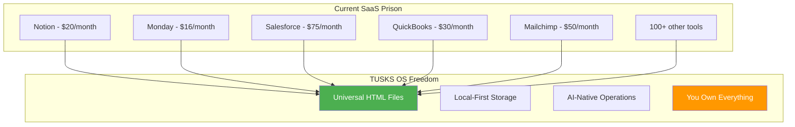
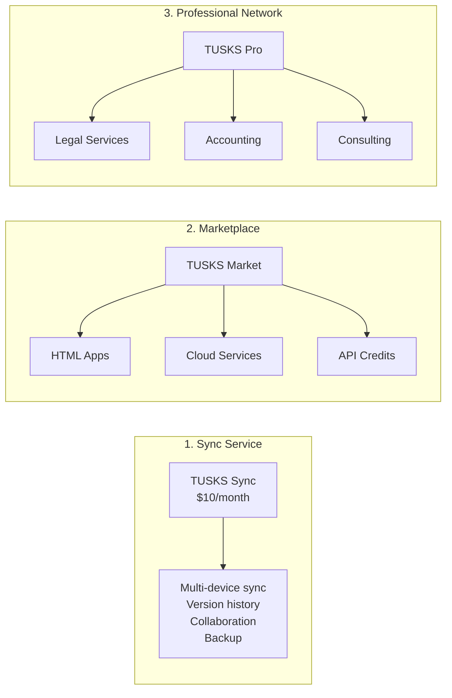
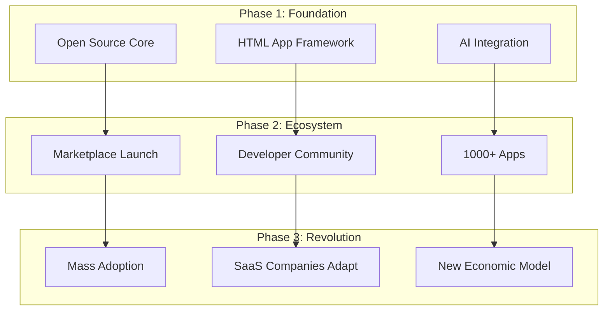
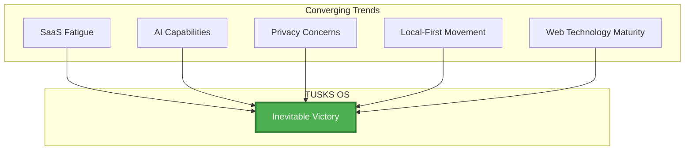

# TUSKS OS - Vision Document

## 🚀 The Revolutionary Vision: Obsidian for HTML

**TUSKS OS** is the world's first HTML-native knowledge operating system that liberates small businesses from SaaS tyranny by providing enterprise-grade capabilities through local-first, privacy-respecting, AI-enhanced HTML documents that work everywhere, forever.

---

## 🎯 Mission Statement

**Transform how 8 billion people work by replacing thousands of fragmented SaaS subscriptions with a single, open-source, HTML-based operating system that gives every business—from solo entrepreneurs to Fortune 500s—complete ownership of their tools, data, and workflows.**

---

## 🧠 Core Philosophy: HTML as the Universal Business Language

### Why HTML Changes Everything



### The HTML Advantage

```yaml
Why HTML Beats Everything:
  Universal Compatibility:
    - Works in any browser, any device, any OS
    - No proprietary formats or vendor lock-in
    - Human-readable for 50+ years
    - Machine-parseable forever
    
  Rich Interactivity:
    - Full GUI capabilities built-in
    - JavaScript for complex logic
    - CSS for beautiful interfaces
    - WebAssembly for native performance
    
  Instant Deployment:
    - Double-click to open
    - No installation required
    - Works offline by default
    - Syncs when connected
    
  AI-Ready:
    - Structured data that LLMs understand
    - Semantic HTML provides context
    - Easy to generate and modify
    - Perfect for automation
```

---

## 🏗️ System Architecture

### Core Technology Stack

```
┌─────────────────────────────────────────────────────────────┐
│                        TUSKS OS CORE                         │
├─────────────────────────────────────────────────────────────┤
│                                                               │
│  📄 Document Layer                                           │
│  ┌─────────────────────────────────────────────────────┐    │
│  │ HTML (Primary) │ Markdown │ PDF │ DOCX │ XLSX      │    │
│  └─────────────────────────────────────────────────────┘    │
│                                                               │
│  💾 Storage Layer                                            │
│  ┌─────────────────────────────────────────────────────┐    │
│  │ Local Files │ Git │ GitHub │ Google Drive │         │    │
│  │ SQLite │ DuckDB │ CSV │ Uploadthing                 │    │
│  └─────────────────────────────────────────────────────┘    │
│                                                               │
│  🔧 Processing Layer                                         │
│  ┌─────────────────────────────────────────────────────┐    │
│  │ JavaScript Runtime │ WebAssembly │ Python Bridge    │    │
│  │ Bash Integration │ API Management │ CLI Tools       │    │
│  └─────────────────────────────────────────────────────┘    │
│                                                               │
│  🤖 AI Layer                                                 │
│  ┌─────────────────────────────────────────────────────┐    │
│  │ Claude │ GPT-4 │ Local LLMs │ Custom Agents        │    │
│  │ Vector Search (Qdrant) │ Knowledge Graph (Neo4j)    │    │
│  └─────────────────────────────────────────────────────┘    │
│                                                               │
│  🖥️ Interface Layer                                          │
│  ┌─────────────────────────────────────────────────────┐    │
│  │ HTML GUIs │ Electron App │ Web Browser │ Mobile    │    │
│  │ Terminal Integration │ VS Code Plugin │ API         │    │
│  └─────────────────────────────────────────────────────┘    │
│                                                               │
└─────────────────────────────────────────────────────────────┘
```

### Everything is an HTML App

```javascript
// Example: CRM as a single HTML file
<!DOCTYPE html>
<html data-tusks-app="crm" data-version="1.0">
<head>
    <title>TUSKS CRM</title>
    <link rel="stylesheet" href="tusks://core/styles.css">
    <script src="tusks://core/runtime.js"></script>
</head>
<body>
    <tusks-navbar></tusks-navbar>
    
    <main id="crm-app">
        <!-- Entire CRM runs in one HTML file -->
        <!-- Data stored in embedded SQLite -->
        <!-- Syncs via Git when online -->
        <!-- AI assists with everything -->
    </main>
    
    <script>
        // Local database operations
        const db = new TusksDB('crm.sqlite');
        
        // AI-powered features
        const ai = new TusksAI();
        
        // Cloud sync when available
        const sync = new TusksSync();
    </script>
</body>
</html>
```

---

## 💰 Business Model Revolution

### Three Revenue Pillars



### Marketplace Economics

```yaml
Developer Opportunities:
  HTML App Development:
    - CRM apps: $50-500 one-time
    - Accounting apps: $100-1000 one-time
    - Custom workflows: $200-2000 per project
    - Industry-specific solutions: $500-5000
    
  Plugin Development:
    - Data connectors: $20-200/month recurring
    - AI agents: $10-100/month per user
    - Automation scripts: $5-50 one-time
    - Custom integrations: $100-1000 project
    
  Service Provision:
    - Database hosting: Usage-based pricing
    - API gateway: Per-request billing
    - Vector search: Storage + query costs
    - Knowledge graphs: Complexity-based

Professional Services:
  Legal:
    - Contract review: $200-1000
    - Incorporation: $500-2000
    - Compliance: $100-500/month
    
  Accounting:
    - Bookkeeping: $200-1000/month
    - Tax preparation: $500-5000
    - Financial planning: $100-500/hour
    
  Technical:
    - Setup and migration: $500-5000
    - Custom development: $100-300/hour
    - Training: $200-1000/session
```

---

## 🛡️ Security & Privacy Architecture

### HTML Security Model

```yaml
Security Layers:
  Content Security Policy (CSP):
    - Strict source whitelisting
    - No inline scripts without nonces
    - Sandboxed iframes for plugins
    - Certificate pinning for cloud services
    
  Plugin Verification:
    - Cryptographic signing required
    - Automated security scanning
    - Community review process
    - Sandboxed execution environment
    
  Data Protection:
    - Local encryption at rest
    - End-to-end encryption for sync
    - Zero-knowledge architecture
    - User-controlled key management
    
  Privacy Guarantees:
    - No telemetry without consent
    - No data mining or selling
    - Local-first processing
    - Explicit cloud permissions
```

### Trust Model

```
┌──────────────────────────────────────────┐
│           USER OWNS EVERYTHING           │
├──────────────────────────────────────────┤
│                                          │
│  Local Control                           │
│  ├── All data on user's device          │
│  ├── Works completely offline           │
│  └── User manages permissions           │
│                                          │
│  Transparent Operations                  │
│  ├── Open source core                   │
│  ├── Auditable plugins                  │
│  └── Verifiable sync                    │
│                                          │
│  No Lock-in                             │
│  ├── Export everything anytime          │
│  ├── Standard formats (HTML, SQLite)    │
│  └── Git-based version control          │
│                                          │
└──────────────────────────────────────────┘
```

---

## 🎯 Target Market & Use Cases

### Primary Users

```yaml
Small Businesses (1-50 employees):
  Current Pain:
    - $500-5000/month in SaaS subscriptions
    - Data scattered across 20+ tools
    - No integration between systems
    - Vendor lock-in everywhere
    
  TUSKS Solution:
    - One-time purchase or $10/month sync
    - All data in one place
    - Everything integrated by default
    - Own everything forever

Solo Entrepreneurs:
  Current Pain:
    - $100-500/month for basic tools
    - Complexity of managing multiple accounts
    - Loss of data when canceling subscriptions
    
  TUSKS Solution:
    - Free core system
    - Pay only for what you need
    - Keep everything when you stop paying
    
Consultants & Agencies:
  Current Pain:
    - Managing multiple client systems
    - Expensive per-seat licensing
    - Security and compliance challenges
    
  TUSKS Solution:
    - Unlimited local installations
    - Client-specific workspaces
    - Complete audit trails
```

### Enterprise Potential

```yaml
Enterprise Adoption Path:
  Pilot Phase:
    - Individual teams adopt for specific projects
    - Prove value with rapid prototyping
    - No procurement process needed
    
  Expansion Phase:
    - Department-wide adoption
    - Custom plugin development
    - Integration with legacy systems
    
  Enterprise Phase:
    - Company-wide deployment
    - Private marketplace
    - Custom service agreements
```

---

## 🌍 Disruption Strategy

### How We Destroy SaaS



### Why SaaS Companies Can't Compete

```yaml
Structural Advantages:
  No Infrastructure Costs:
    - Users provide their own compute
    - No cloud hosting expenses
    - No scaling challenges
    
  Zero Marginal Cost:
    - Infinite distribution
    - No per-user expenses
    - Community-driven development
    
  Network Effects:
    - Every user can become a developer
    - Every business creates templates
    - Knowledge compounds globally
    
  True Ownership:
    - Users will never go back to renting
    - Data portability is non-negotiable
    - Privacy becomes competitive advantage
```

---

## 🚀 Launch Strategy

### MVP Features (Month 1)

```yaml
Core System:
  ✅ HTML file management system
  ✅ Local SQLite integration  
  ✅ Basic Git sync
  ✅ Simple plugin architecture
  ✅ AI chat interface

Essential Apps:
  ✅ Note-taking app
  ✅ Task management
  ✅ Simple CRM
  ✅ Basic accounting
  ✅ File manager

Developer Tools:
  ✅ App creation wizard
  ✅ Plugin SDK
  ✅ Testing framework
  ✅ Documentation generator
```

### Growth Milestones

```yaml
Month 1-3: Foundation
  - 1,000 early adopters
  - 10 core apps
  - Basic marketplace
  - Developer documentation
  
Month 4-6: Ecosystem
  - 10,000 active users
  - 100+ apps in marketplace
  - Professional services launch
  - Enterprise pilot programs
  
Month 7-12: Scale
  - 100,000 active users
  - 1,000+ apps
  - $1M monthly marketplace volume
  - Series A funding
  
Year 2: Revolution
  - 1 million users
  - Industry disruption visible
  - Major SaaS companies responding
  - Global expansion
```

---

## 🎭 Cultural Impact

### The New Work Paradigm

```yaml
Before TUSKS:
  - Renting software monthly
  - Data held hostage
  - Constant price increases
  - Feature removal threats
  - Privacy violations
  
After TUSKS:
  - Owning tools forever
  - Data sovereignty
  - Predictable costs
  - Features never disappear
  - Complete privacy
```

### Economic Revolution

```yaml
Developer Economy:
  Old Model:
    - Work for SaaS companies
    - Build features users don't want
    - Artificial scarcity
    - Rent-seeking behavior
    
  TUSKS Model:
    - Work directly for users
    - Build what's actually needed
    - Abundance mindset
    - Value creation focus

Small Business Liberation:
  Financial Impact:
    - Save $1000-5000/month
    - Invest in growth not rent
    - Predictable technology costs
    - No surprise price hikes
    
  Operational Impact:
    - Complete data control
    - Infinite customization
    - No vendor dependencies
    - True digital sovereignty
```

---

## 🔮 10-Year Vision

### The Post-SaaS World

```yaml
2025-2027: The Awakening
  - Businesses realize they don't need SaaS
  - Mass migration begins
  - SaaS companies panic
  
2028-2030: The Transformation  
  - TUSKS becomes standard business OS
  - New developer economy thrives
  - Traditional SaaS model collapses
  
2031-2035: The New Normal
  - Software ownership is expected
  - Privacy is non-negotiable
  - AI agents work locally
  - Global knowledge commons established
```

### Ultimate Success Metrics

```yaml
Quantitative Goals:
  - 100 million businesses using TUSKS
  - $100 billion saved annually on software
  - 10 million developers in ecosystem
  - 1 billion HTML apps created
  
Qualitative Goals:
  - End software rental model
  - Restore data sovereignty
  - Democratize enterprise tools
  - Create true digital freedom
```

---

## 🎯 Why This Wins

### The Unstoppable Forces

1. **Economic Pressure**: Businesses can't afford endless SaaS subscriptions
2. **Privacy Demands**: Data breaches make local-first inevitable
3. **AI Revolution**: LLMs make HTML apps trivially easy to create
4. **Developer Frustration**: Talented developers want to build, not rent-seek
5. **Regulatory Pressure**: Governments demanding data sovereignty

### The Perfect Storm



---

## 🏁 Call to Action

**The SaaS empire is crumbling. The age of software ownership is beginning.**

**TUSKS OS isn't just another tool—it's a revolution. It's the moment businesses take back control of their digital destiny.**

**Join us in building the future where:**
- Every business owns their tools
- Every developer creates real value
- Every user controls their data
- Every innovation benefits everyone

**The revolution starts with a single HTML file.**

**Welcome to TUSKS OS.**
**Welcome to freedom.**

---

*"In a world where you own nothing and rent everything, TUSKS OS says: Own everything, rent nothing."*

**[Start Building Today: github.com/tusks-os]()**
**[Join the Revolution: tusks.os]()**
**[Developer Portal: dev.tusks.os]()**
